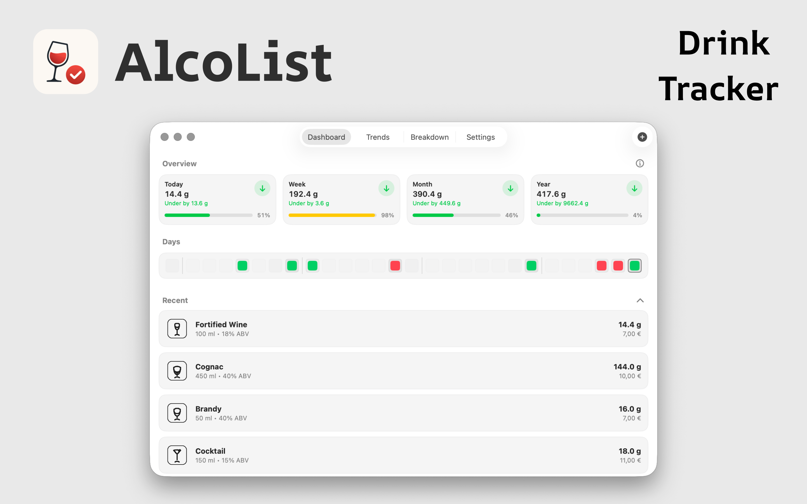
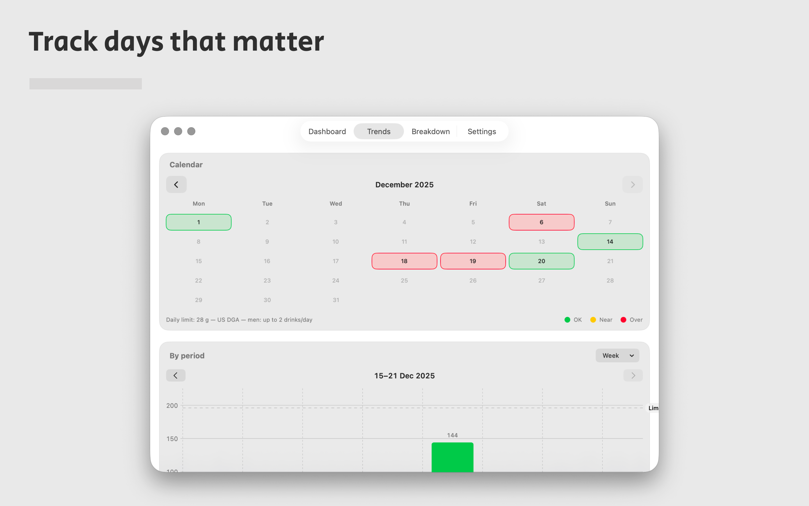
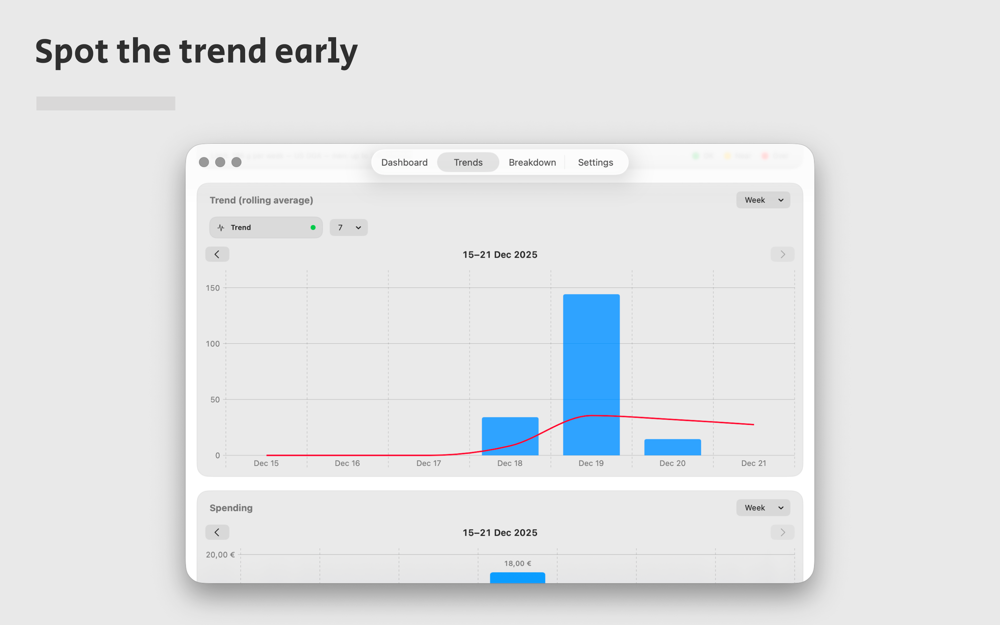
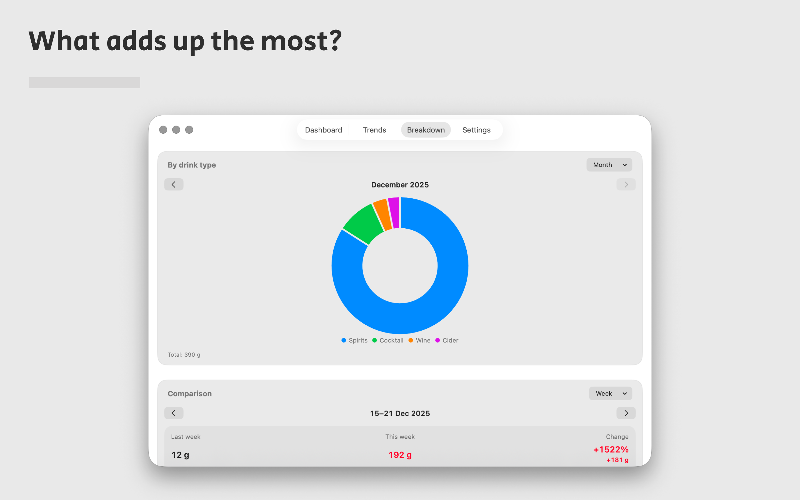
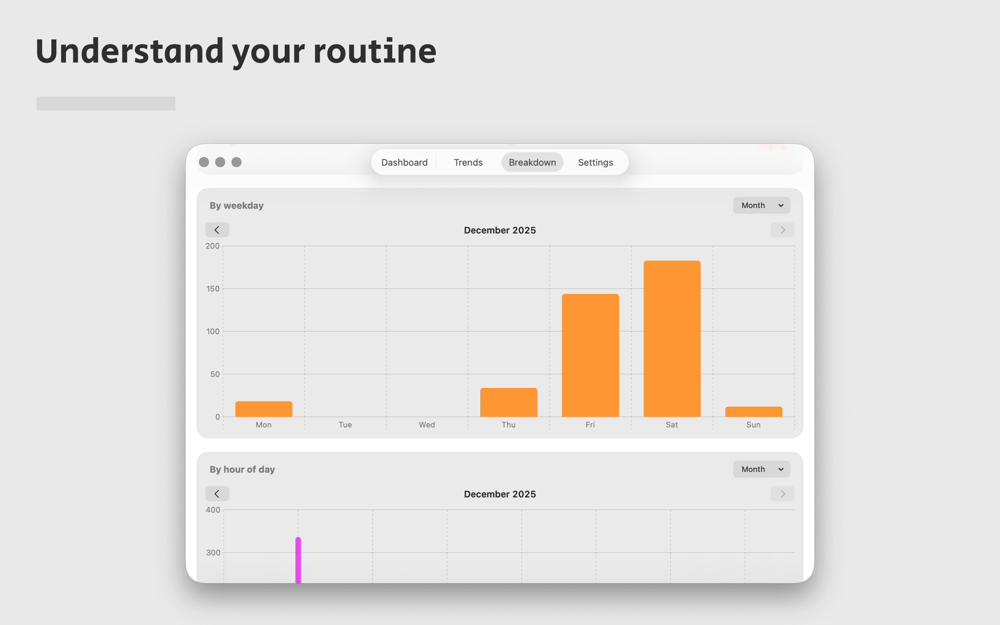

# AlcoList

> Alcohol tracker focused on limits, clarity, and better mornings.

AlcoList is an alcohol tracking app with a calm and thoughtful workflow. It is designed to help users log drinks, stay aware of limits, and understand patterns over time without turning the experience into a gamified system.

## Project status

**Status:** Active  
**Type:** Apple app  
**Code availability:** Private

## Platform / Availability

- iPhone
- Mac

## Key features

- Drink logging
- Limit awareness
- Clear overview of alcohol intake
- Calm, non-gamified design
- Focus on clarity and better decisions
- Built for Apple devices

## Screenshots

## Links

- Website: https://alcolist.com/igp
- App Store: https://apps.apple.com/es/app/alcolist-alcohol-tracker/id6756630744
- Google Play: https://play.google.com/store/apps/details?id=com.robpenski.alcolist
- Facebook: https://www.facebook.com/alcolistalcoholtracker/
- LinkedIn: https://www.linkedin.com/company/alcolist/about/?viewAsMember=true
- X: https://x.com/alcolist_com
- Portfolio page: https://stargap.one/products/alcolist
- GitHub repo: https://github.com/roqd-one/alcolist
- GitHub profile: https://github.com/roqd-one

## Suggested GitHub topics

`alcohol-tracker`, `wellness`, `self-tracking`, `ios`, `macos`, `swift`, `private-by-design`, `apple-app`

## Changelog

See [CHANGELOG.md](./CHANGELOG.md).

## Feedback / Issues

This repository serves as a public product page and lightweight documentation hub.

If you want to report a bug, suggest an improvement, or ask about the product, open an issue in this repository or use the contact path on the official website.

## Why this repo exists

This is a public showcase repository for AlcoList — a place for product overview, screenshots, links, and lightweight release notes.

## Source code

AlcoList is actively developed, but the application source code is private.

## Related projects

- [qdBox](https://github.com/roqd-one/qdbox-app)
- [AirMQTT](https://github.com/roqd-one/airmqtt-app)
- [PostFox](https://github.com/roqd-one/postfox)
- [NowAgo](https://github.com/roqd-one/nowago)
- [StoreProof](https://github.com/roqd-one/storeproof-app)
- [LumiGap](https://github.com/roqd-one/lumigap-poker-ai)
